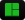

<!-- HEADER -->

    

<h1 align="center">Kshitij K</h1>
<!-- END OF HEADER -->

<!-- ABOUT ME -->
&nbsp;**ABOUT ME**

- 👨‍🎓Computer Engineer
- 🛡️ Privacy enthusiast
- &nbsp;Interested in server management, self-hosting privacy-first cloud services
- &nbsp;Hosting privacy focused cloud services at &nbsp;&nbsp; [KSKA](https://kska.io)

Find out more about my projects on my  [self hosted git server](https://git.kska.io/notkshitij/)!

> [!IMPORTANT]
> All of my commits are signed using my [GPG key](./keys/personal-pubkey.asc).
<!-- END OF ABOUT ME -->

<!-- LINE -->

  

<!-- PROJECTS -->
&nbsp;**PROJECTS**

  
<a href="https://kska.io">1. KSKA Cloud Services</a>

	<ul>
		<li>Deployed self-hosted services (Ghost CMS, Gitea, Nextcloud, etc.) using Docker on hardened Debian/Arch systems (with LUKS, ZFS, BTRFS, LVM).</li>
	</ul>

  
<a href="https://git.kska.io/notkshitij/PiDetectify">2. PiDetectify</a>

	<ul>
		<li>Developed a real-time monitoring system using Raspberry Pi, featuring motion detection capabilities.</li>
		<li>Implemented secure alert dispatch through <a href="https://ntfy.sh/">ntfy.sh</a> for immediate notifications.</li>
    	<li>Utilized <a href="https://www.wireguard.com">WireGuard VPN</a> to ensure secure communication when users are outside the local network.</li>
    	<li>Containerized the entire application stack with Docker to enhance scalability and deployment efficiency.</li>
    	<li>Raspberry Pi for processing tasks and Pi Camera for motion detection.</li>
    	<li>Notifications are triggered upon motion detection and sent to users via ntfy.sh.</li>
    	<li>Both ntfy.sh and WireGuard run in separate Docker containers, ensuring modularity and ease of management.</li>
    	<li>The entire system operates locally, providing a secure and efficient monitoring solution.</li>
	</ul>

	
<a href="https://git.kska.io/notkshitij/CropCompass">3. CropCompass</a>

	<ul>
		<li>Developed a unified dashboard for comprehensive farm management.</li>
		<li>Enabled real-time tracking and management of farm operations.</li>
		<li>Implemented logging of key activities, including sowing, fertilization, and harvesting.</li>
		<li>Integrated financial planning tools for tracking expenses and revenue.</li>
		<li>Incorporated AI-powered recommendations and disease detection capabilities.</li>
		<li>Utilized Google Gemini for predictive crop health analysis.</li>
		<li>Provided multilingual support, currently available in English, Hindi, Marathi, and French.</li>
		<li>Deployed AI for crop disease detection and predictive harvesting using Gemini AI.</li>
	</ul>

	
<a href="https://git.kska.io/notkshitij/Skycrate">4. Skycrate</a>

	<ul>
		<li>Dockerized a <a href="https://git.kska.io/notkshitij/docker-hadoop">Hadoop cluster</a> to resolve dependency issues, hosting it internally and exposing it to the team via Tailscale.</li>
		<li>Integrated internationalization (i18n) for multilingual support across the frontend.</li>
		<li>Implemented hybrid RSA-AES encryption for each file, utilizing user-specific key pairs.</li>
		<li>Established strong password policies with breach checks via Have I Been Pwned.</li>
		<li>Utilized JWT-based authentication with refresh token support and a blacklist feature upon logout.</li>
		<li>Implemented brute-force login protection through rate limiting.</li>
		<li>Enforced HTTPS with automatic redirection from HTTP to HTTPS.</li>
		<li>Enabled encrypted file upload and download to/from HDFS, with metadata stored in a database.</li>
		<li>Developed audit logging and structured Data Transfer Objects (DTOs) with validation.</li>
		<li>Created a token refresh endpoint and ensured secure session handling.</li>
		<li>Automated user directory creation in HDFS upon user registration.</li>
		<li>Enhanced Spring Security, streamlined configuration, and established a modular service structure.</li>
	</ul>

<!-- END OF PROJECTS -->

<!-- LINE -->

  

<!-- SKILLS -->
&nbsp; **SKILLS**

*Containerization & Virtualization*

&nbsp;
&nbsp;

*Version Control & Collaboration*

&nbsp;
&nbsp;
&nbsp;

*Cloud Platforms*

&nbsp;

*Programming Languages*

&nbsp;
&nbsp;

*System Administration*

&nbsp;
&nbsp;

*Networking*

&nbsp;
&nbsp;
&nbsp;
&nbsp;
&nbsp;

*Database Management*

&nbsp;

*Web Development*

&nbsp;
&nbsp;
&nbsp;
&nbsp;

*Frameworks & Libraries*

&nbsp;
&nbsp;
&nbsp;

*Web & Mail Servers*

&nbsp;
&nbsp;

<!-- END OF SKILLS -->

<!-- LINE -->

  

<!-- FOOTER -->

	&nbsp;
	&nbsp;
	&nbsp;
	&nbsp;
	&nbsp;
	&nbsp;
	&nbsp;

<!-- END OF FOOTER -->